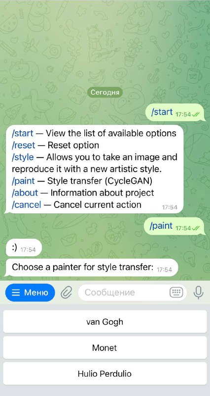
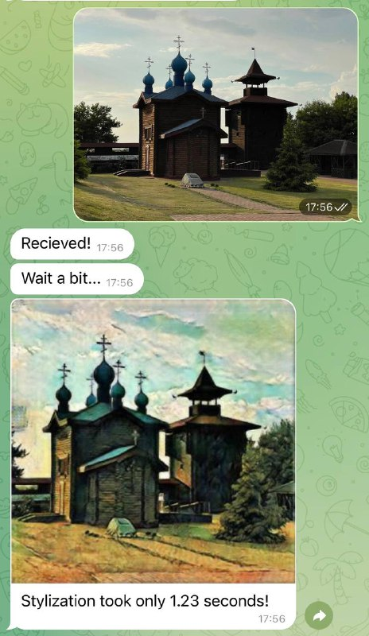
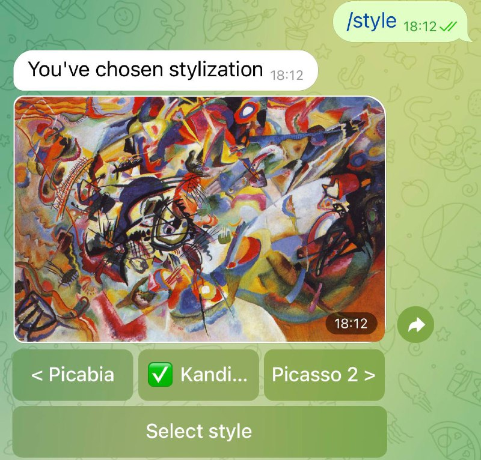
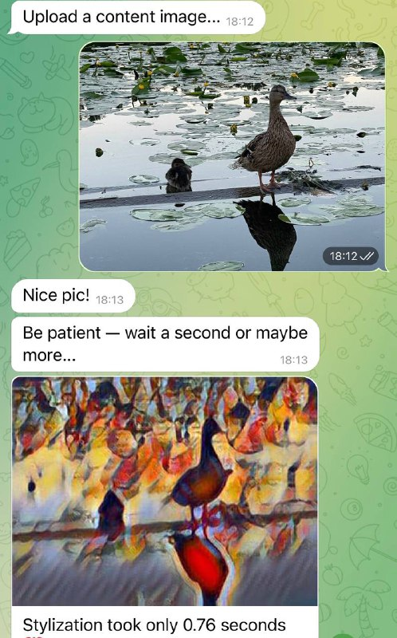

## asynchronous telegram bot

<b>This is a final project of the first advanced semester on DLS (MIPT).</b>

### Description of project

There are two modes inside the bot.

Painter mode based on CycleGAN which was intoduced at ICCV 2017. The CycleGAN is a technique that involves the automatic training of image-to-image translation models without paired examples. The models are trained in an unsupervised manner using a collection of images from the source and target domain that do not need to be related in any way. CycleGAN is extremely usable because it doesn’t need paired data.

The second mode is style mode and it based on Neural-Style algorithm developed by Leon A. Gatys, Alexander S. Ecker and Matthias Bethge. The algorithm takes three images, an input image, a content-image, and a style-image, and changes the input to resemble the content of the content-image and the artistic style of the style-image. The are 21 pretrained NN in this bot.

### Examples

#### Paint mode

#### Style mode

